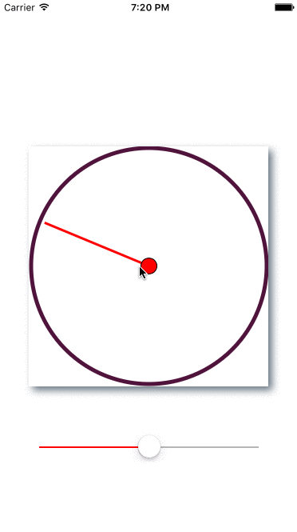

# ClockHand
iOS app written in swift which rotates line like clock hand. Rotation speed can be controlled by the slider. Also project demonstrates how to use CALayer in swift.

# Clock Hand Usage #

checkout this screencast on [how to Use](http://recordit.co/7joAwbJlOv)

This project demonstrates how to use CALayer, custom drawings, programmatically adding slider in Swift Code.
